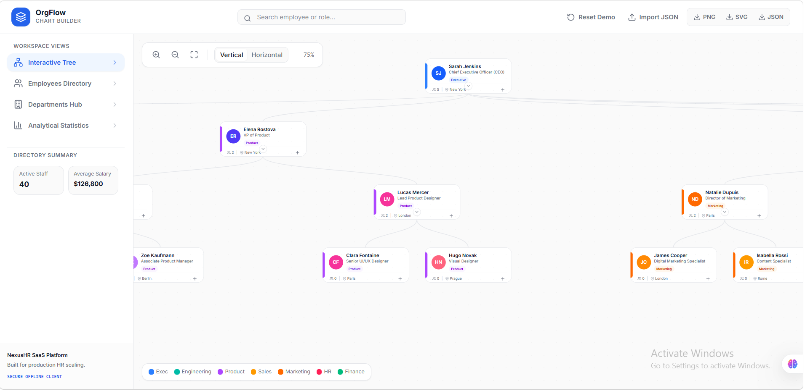
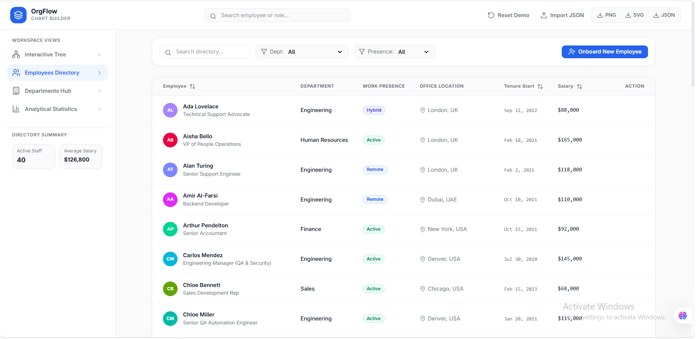
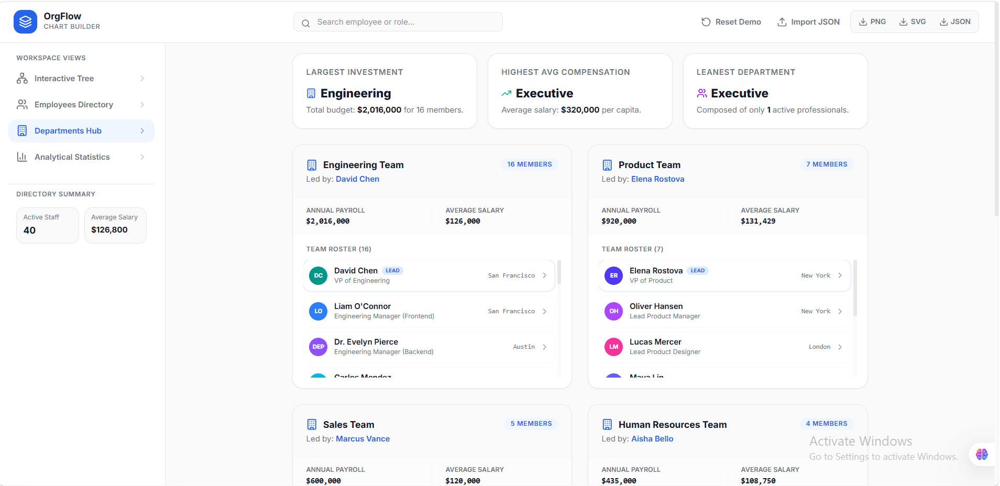
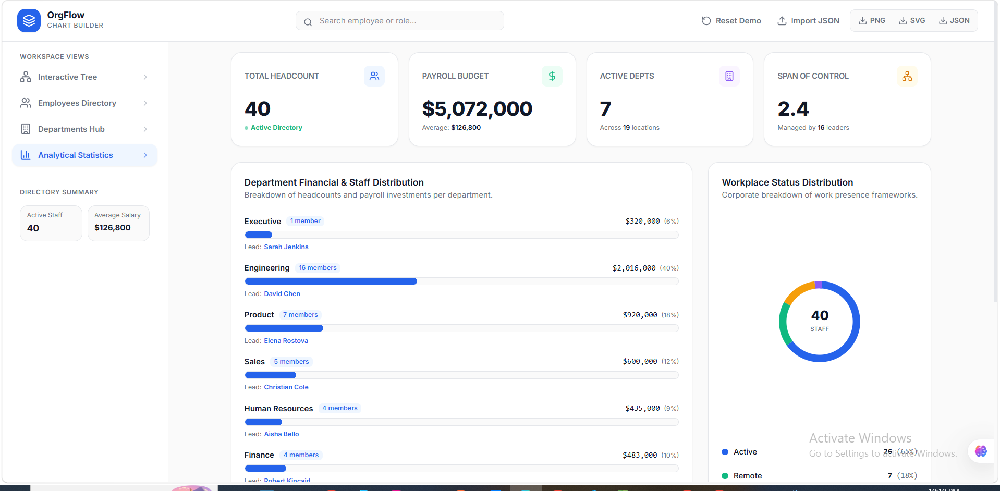

# NexusHR – Interactive Organization Chart Builder

A modern and interactive **Organization Chart Builder** built with **React, TypeScript, Vite, Tailwind CSS, and D3.js**. NexusHR enables organizations to visualize reporting structures, manage employee information, analyze workforce statistics, and export organizational data through a clean, enterprise-inspired user interface.

---

##  Live Demo

https://interactive-org-chart-builder-658ozz8cq-nooruleman.vercel.app/

---

##  Screenshots

### Interactive Organization Chart



### Employee Directory



### Department Dashboard



### HR Analytics Dashboard



---

##  Features

###  Interactive Organization Chart
- Interactive D3.js tree visualization
- Zoom and pan functionality
- Vertical and horizontal layout switching
- Expand and collapse reporting hierarchy
- Smooth navigation between employees

###  Employee Management
- Add new employees
- Edit employee information
- Delete employees safely
- Automatic subordinate reassignment
- Circular reporting validation

###  Employee Directory
- Search employees instantly
- Department filtering
- Presence filtering
- Sort by salary
- Sort by joining date
- Click employee to locate in organization chart

###  Department Hub
- Department summaries
- Team member listings
- Department payroll
- Average salary statistics
- Team leadership overview

###  Analytics Dashboard
- Total employees
- Payroll statistics
- Department distribution
- Workplace status charts
- Salary insights
- Organization metrics

###  Import & Export
- Import organization data (JSON)
- Export organization data (JSON)
- Export organization chart as SVG
- Export organization chart as PNG

###  Local Storage
- Automatic data persistence
- Fast client-side performance
- No backend required

---

#  Tech Stack

| Technology | Purpose |
|------------|---------|
| React 19 | Frontend Framework |
| TypeScript | Type Safety |
| Vite | Build Tool |
| Tailwind CSS | Styling |
| D3.js | Organization Chart Visualization |
| Lucide React | Icons |
| Framer Motion | Animations |
| Local Storage | Data Persistence |

---

#  Project Structure

```text
Interactive-Org-Chart-Builder
│
├── src
│   ├── components
│   │   ├── AddEditModal.tsx
│   │   ├── DepartmentsView.tsx
│   │   ├── DetailsPanel.tsx
│   │   ├── DirectoryView.tsx
│   │   ├── OrgChartCanvas.tsx
│   │   └── StatsDashboard.tsx
│   │
│   ├── data
│   │   └── sampleData.ts
│   │
│   ├── App.tsx
│   ├── main.tsx
│   ├── index.css
│   ├── types.ts
│   └── vite-env.d.ts
│
├── package.json
├── package-lock.json
├── tsconfig.json
├── vite.config.ts
├── index.html
└── README.md
```

---

#  Getting Started

## Prerequisites

Make sure you have installed:

- Node.js (v18 or later)
- npm

---

## Installation

Clone the repository

```bash
git clone https://github.com/NoorULEman023/Interactive-Org-Chart-Builder.git
```

Navigate to the project folder

```bash
cd Interactive-Org-Chart-Builder
```

Install dependencies

```bash
npm install
```

Start the development server

```bash
npm run dev
```

Open your browser and visit

```
http://localhost:3000
```

---

#  Build for Production

```bash
npm run build
```

Preview production build

```bash
npm run preview
```

---

#  Future Improvements

- Drag-and-drop employee reassignment
- Multiple organization support
- Authentication and user roles
- Database integration
- Cloud synchronization
- Employee profile images
- Dark mode
- PDF organization chart export
- Advanced HR reporting
- REST API integration

---

#  Design Highlights

- Minimal Light Theme
- Responsive Layout
- Modern Enterprise UI
- Clean Typography
- Soft Shadows
- Rounded Components
- Professional Dashboard Design

---

#  License

This project is licensed under the **MIT License**.

---

#  Author

**Noor UL Eman**

**BS Software Engineering Student**

GitHub: https://github.com/NoorULEman023

---

##  Support

If you found this project helpful, consider giving it a **⭐ Star** on GitHub.
